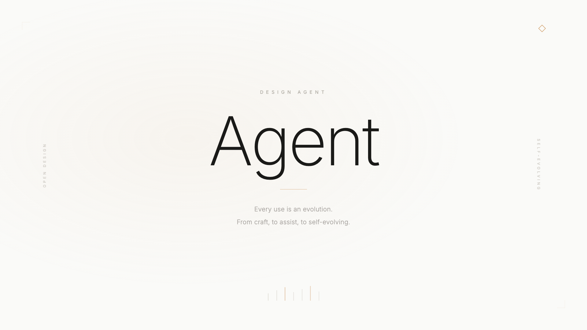

# GO4AI AI Video (`go4ai-ai-video`)

> [!NOTE]
> **Ghi chú**: Dự án này dựa một phần trên [html-video](https://github.com/nexu-io/html-video) của nexu-io, phát hành theo giấy phép Apache License 2.0.
> Toàn bộ codebase đã được **GO4AI viết lại và mở rộng đáng kể** để phù hợp với người dùng Việt Nam không biết code.

<p align="center">
  
</p>

<h3 align="center">💰 0 ĐỒNG PHÍ RENDER · 0 ĐỒNG PHÍ BẢN QUYỀN · 0 GIỚI HẠN SỐ VIDEO</h3>

<p align="center">
✅ <b>Miễn phí vĩnh viễn</b> — mã nguồn mở Apache-2.0, không phí license, không phí theo lượt render, không thu phí ẩn<br/>
✅ <b>Chạy 100% trên máy bạn</b> — video render tại chỗ bằng Chromium + FFmpeg, không upload dữ liệu lên server nào<br/>
✅ <b>Không giới hạn số lượng</b> — render bao nhiêu video tuỳ thích, không đếm lượt, không giới hạn export<br/>
✅ <b>Không cần biết code</b> — double-click 1 file để chạy, không mở terminal, không gõ lệnh<br/>
✅ <b>26 mẫu video sẵn có</b> — sạch bản quyền, dùng được cho công việc thương mại, không cần audit lại
</p>

<p align="center">
  <a href="LICENSE"></a>
  <a href="#supported-agents"></a>
  <a href="#showcase"></a>
  <a href="#turn-a-link-into-a-video"></a>
  <a href="#soundtrack"></a>
  <a href="#quick-start"></a>
</p>

<p align="center">
  <b>Xây dựng và duy trì bởi <a href="https://github.com/tbxaigen-design">GO4AI</a></b> · Không trực thuộc và không được nexu-io / Open Design bảo trợ
</p>

<p align="center"><a href="HUONG-DAN-SU-DUNG.md"><b>Hướng dẫn chi tiết tiếng Việt</b></a> · <a href="README.zh-CN.md">简体中文</a></p>

---

<h2 id="quick-start">🚀 Bắt đầu ngay — chỉ cần double-click</h2>

Tải repo này về (nút xanh **Code** ở đầu trang → **Download ZIP**), giải nén, rồi:

| Máy bạn dùng | Double-click file này |
|---|---|
| **Windows** | `1-Chay-Tren-Windows.bat` |
| **MacBook** | `1-Chay-Tren-Macbook.command` — lần đầu chuột phải → **Open** |

Lần chạy đầu tự tải mọi thứ cần thiết (Node.js nếu chưa có, thư viện, FFmpeg, trình render Chromium — khoảng **300MB**, 5–10 phút). Các lần sau khởi động trong vài giây. Trình duyệt tự mở studio tại `http://127.0.0.1:3075`.

Muốn cập nhật, double-click `2-Cap-Nhat-Windows.bat` / `2-Cap-Nhat-Macbook.command`.

> Hướng dẫn chi tiết từng bước, có ảnh minh hoạ: **[HUONG-DAN-SU-DUNG.md](HUONG-DAN-SU-DUNG.md)**

<details>
<summary><b>Dành cho lập trình viên — chạy bằng dòng lệnh</b></summary>

```bash
pnpm install          # bao gồm binary ffmpeg/ffprobe cho hệ điều hành của bạn
pnpm -r build
node setup-binaries.js   # kiểm tra FFmpeg, cài Chromium + edge-tts
node ui-server.js        # studio chạy tại http://127.0.0.1:3075
```

Biến môi trường tuỳ chọn: `FFMPEG_PATH`, `FFPROBE_PATH`, `EDGE_TTS_PATH`, `PORT`.

```bash
node packages/cli/dist/bin.js doctor                 # phát hiện agent + engine đã cài
node packages/cli/dist/bin.js search-templates --intent "github stars race" --top 3
```

</details>

---

<h2 id="production-scale">Một quy trình, bốn mảng nội dung, không giới hạn số lượng</h2>

<p align="center">Cùng một pipeline — prompt hoặc link vào, MP4 ra — vận hành tốt như nhau ở cả 4 nhóm nội dung dưới đây. Đổi nội dung, giữ nguyên phong cách thương hiệu, xuất hàng loạt.</p>

<p align="center">

</p>

### A · 🎬 Social video
Video ngắn cho TikTok, Reels, LinkedIn, YouTube Shorts — dựng từ một dòng ý tưởng hoặc một bài viết có sẵn. Nhiều cảnh, nhịp nhanh, tiêu đề bắt mắt, xuất theo tỷ lệ dọc/ngang tuỳ nền tảng.

<p align="center">

</p>

### B · 🎓 eLearning
Bài giảng, module đào tạo, giải thích khái niệm — kịch bản được chia thành các cảnh có trình tự logic, đúng dữ liệu, có giọng đọc AI đi kèm nếu cần.

<p align="center">

</p>

### C · 📋 SOP / hướng dẫn nội bộ
Quy trình vận hành, hướng dẫn dùng phần mềm, onboarding nhân sự mới — biến một tài liệu văn bản khô khan thành video các bước rõ ràng, dễ theo dõi hơn nhiều so với một file Word.

<p align="center">

</p>

### D · 🚀 Product demo
Giới thiệu tính năng, ra mắt sản phẩm, walkthrough cho nhà đầu tư hoặc khách hàng — dán link repo hoặc landing page, AI tự đọc và dựng thành video giới thiệu có cấu trúc.

<p align="center">Bốn nhóm trên dùng chung 26 mẫu, chung engine render, chung vòng lặp AI — không có bản riêng "giá cao hơn" cho từng use case.</p>

<p align="center">👇 Không phải mockup — đây là một video thật, render bằng chính pipeline trên (nhóm A · Social video):</p>

<p align="center">
  <a href="https://www.youtube.com/watch?v=ZjZDOSL9yio">
    
  </a>
  <br/>
  <a href="https://www.youtube.com/watch?v=ZjZDOSL9yio"><b>▶ Bấm để xem trên YouTube</b></a>
  · <a href="https://raw.githubusercontent.com/tbxaigen-design/go4ai-ai-video/main/docs/assets/video/go4ai-linkedin-60s-mien-nam.mp4">tải file MP4 gốc</a>
</p>

<p align="center"><i>Giọng đọc AI Miền Nam · 9 cảnh · 60 giây · không qua chỉnh sửa hậu kỳ.</i></p>

---

<h2 id="showcase">Thư viện mẫu</h2>

Mỗi mẫu dưới đây là một video HTML thật, có chuyển động thật — không phải ảnh dựng. Chọn một mẫu, để AI điền nội dung của bạn vào, rồi xuất ra MP4.

<p align="center">
<br/>
<b>frame-data-chart-nyt</b> · biểu đồ dữ liệu — cho câu chuyện "con số này đã tăng"
</p>

<p align="center">
<br/>
<b>frame-glitch-title</b> · tiêu đề mở đầu — cảm giác "hệ thống đã sẵn sàng"
</p>

<p align="center">
<br/>
<b>frame-liquid-bg-hero</b> · hero — cho ra mắt sản phẩm, tuyên ngôn mạnh
</p>

<p align="center">
<br/>
<b>frame-light-leak-cinema</b> · điện ảnh — cho video cảm xúc, phim thương hiệu
</p>

<p align="center">
<br/>
<b>vfx-text-cursor</b> · hiệu ứng — chữ đánh máy, demo kiểu terminal
</p>

<p align="center">
<br/>
<b>frame-logo-outro</b> · kết thúc — thẻ logo động, sign-off gọn gàng
</p>

…và 20 mẫu khác: quảng cáo sản phẩm nhiều cảnh, chữ động, thẻ dữ liệu Thụy Sĩ/Vignelli, sơ đồ giải thích quyết định, chuyển động hữu cơ kiểu Takram, phong cách báo chí hạt film ấm. Xem đầy đủ 26 mẫu ngay trong thư viện của studio.

---

## Vì sao GO4AI làm bản này

Bản gốc [html-video](https://github.com/nexu-io/html-video) là một công cụ rất mạnh, nhưng được thiết kế cho **lập trình viên** — muốn dùng phải mở terminal, gõ `pnpm install`, tự cấu hình agent, tự đọc log lỗi. Với đa số người dùng Việt Nam làm nội dung, marketing, giáo dục — những người **không biết code và không có nhu cầu học code** — rào cản đó đủ để họ bỏ cuộc ngay từ bước cài đặt.

Toàn bộ lớp vận hành đã được viết lại từ gốc: dòng lệnh terminal trở thành **một file để double-click**; thông báo lỗi tiếng Anh trở thành hướng dẫn tiếng Việt rõ ràng từng bước; việc tự tay cài Node.js, FFmpeg, Chromium trở thành **quy trình tự tải và tự cài đặt** ngay trong lần chạy đầu tiên. Không có bước nào trong đó là dịch giao diện — mỗi bước là một phần được dựng lại để phù hợp với người dùng chưa từng mở terminal.

Mục tiêu của GO4AI: mang công nghệ AI tạo video mã nguồn mở đến gần hơn với cộng đồng người Việt — miễn phí, chạy ngay trên máy cá nhân, dữ liệu không rời khỏi máy bạn trừ khi bạn chủ động dùng tính năng có gọi mạng (lấy nội dung từ link/repo, tạo nhạc AI).

---

## Nó hoạt động thế nào

Một câu mô tả (hoặc một đường link) đi vào; một file MP4 thật đi ra:

**`prompt / link / repo`** ⬇️

1. **Lấy nguồn** — studio tự tải nội dung từ URL hoặc repo, chuyển thành văn bản Markdown
2. **Vòng lặp agent** — AI đọc nội dung + phong cách mẫu đã chọn, tạo ra kịch bản + HTML từng khung hình
3. **Content-graph** — cấu trúc trung gian đa khung hình, tự sắp xếp thứ tự & thời lượng
4. **HTML từng khung hình** — mỗi cảnh trở thành một khung hình HTML động, độc lập
5. **Hyperframes render** — Chromium chạy ẩn ghi lại từng khung hình → webm
6. **ffmpeg** — mỗi webm → mp4, ghép lại thành một video; nhạc + giọng đọc AI (nếu có) trộn vào

⬇️ **`video-cua-ban.mp4`**

Mọi thứ chạy trên máy bạn — chỉ 2 việc cần mạng: lấy nội dung nguồn (khi dán link/repo) và tạo nhạc/giọng đọc AI (khi dùng tính năng đó). Video một khung hình đi theo đường tắt, bỏ qua content-graph — một mẫu, một HTML, render thẳng.

---

<h2 id="turn-a-link-into-a-video">🔗 Biến một đường link thành video</h2>

Đưa AI một đường link, nhận lại một video. Studio **tự lấy nội dung nguồn** ở phía server rồi đưa cho AI xử lý — không cần copy-paste, và các trang không cần đăng nhập (như bài viết WeChat 公众号) vẫn lấy được bình thường.

```
Bạn:    làm video giải thích bài này  https://mp.weixin.qq.com/s/…
Agent:  được, mình đã đọc xong bài viết — sẽ dựng video dựa trên nội dung này. Bước tiếp theo: chọn phong cách.
→       video giải thích nhiều cảnh, dựng từ đúng nội dung bài viết
```

- **Bài viết web** → tải và chuyển thành Markdown, kể cả trang render sẵn phía server như WeChat 公众号.
- **Repo GitHub** → mô tả, cấu trúc thư mục, README lấy qua GitHub public API — hợp cho video "giải thích dự án mã nguồn mở này".
- **Chỉ cần một câu mô tả** → nêu chủ đề, AI viết nội dung từ đầu.

AI đọc nội dung thật, tự quyết định số cảnh, viết kịch bản theo đúng nội dung nguồn — không phải trang trí quanh một mẫu có sẵn.

---

<h2 id="soundtrack">🎵 Nhạc nền & giọng đọc</h2>

Cho video thành phẩm một "tiếng nói". Vào **Settings → Audio**, thêm MiniMax API key, sau đó ở bảng **Soundtrack** trong từng dự án:

- **Nhạc nền** — mô tả không khí bạn muốn; MiniMax tự tạo bản nhạc không lời.
- **Lời đọc (narration)** — gõ kịch bản; MiniMax đọc thành giọng nói.

Cả hai trộn vào MP4 xuất ra (nhạc tự giảm âm khi có giọng đọc, fade in/out tuỳ chọn). Chưa có key? Phần còn lại của studio vẫn hoạt động bình thường.

---

<details>
<summary><h2 style="display:inline">📎 Chi tiết kỹ thuật — kho mẫu, agent, kiến trúc, lộ trình</h2></summary>

### Kho mẫu (template)

26 mẫu không phải chọn ngẫu nhiên — mỗi mẫu là một đơn vị độc lập, AI đọc được, mô tả bằng file `template.html-video.yaml` mà studio quét khi khởi động:

- **Dùng để làm gì** — `category`, `tags`, danh sách `best_for` mà `search-templates` dùng để khớp ý định của bạn.
- **Xuất ra gì** — độ phân giải, tỷ lệ khung hình, fps, giới hạn thời lượng, kênh alpha/âm thanh.
- **Cần nhập gì** — schema JSON `inputs`, AI biết chính xác cần điền văn bản/dữ liệu vào đâu.
- **Nguồn gốc giấy phép** — mã SPDX cùng cờ `attribution_required` / `redistribution_allowed` / `commercial_use`, và `assets_attribution` trỏ về nguồn gốc.

Mỗi mẫu **sạch về giấy phép ngay từ khi tạo ra**: bản fork giữ nguyên giấy phép gốc, [`NOTICE.md`](templates/NOTICE.md) ghi lại nguồn và SPDX của từng mẫu. Dùng được cho công việc thương mại mà không cần kiểm tra lại.

<h3 id="supported-agents">Các AI agent được hỗ trợ</h3>

Tự động phát hiện agent đã cài trên máy (`PATH`); đổi agent đang dùng ngay trong thanh trên cùng của studio. Studio ưu tiên **Open Design (Vela)** — một lần đăng nhập, dùng nhiều model, chi phí thấp hơn — sau đó tự chuyển sang agent khả dụng đầu tiên tìm thấy.

| Agent | Cách phát hiện | Cách gọi |
|---|---|---|
| **Open Design (Vela)** | `vela` / có sẵn trong app Open Design | ACP qua stdio — đăng nhập một lần, chọn model bất kỳ |
| **Windsurf CLI** | `windsurf` | `windsurf --yolo`, ACP qua stdio |
| **Trae CLI** | `traecli` | `traecli acp serve --yolo`, ACP qua stdio |
| **Claude Code** | `claude` | `claude --print`, prompt qua stdin |
| **Cursor Agent** | `cursor-agent` | `cursor-agent --print` |
| **Codex CLI** | `codex` | `codex exec`, prompt qua stdin |
| **Hermes** | `hermes` | Hermes ACP CLI |
| **Gemini CLI** | `gemini` | Prompt qua stdin |
| **Grok Build** | `grok` | `grok -p <prompt>` |
| **Qwen Code** | `qwen` | Prompt qua stdin |
| **OpenCode** | `opencode` | `opencode run`, prompt qua stdin |
| **GitHub Copilot CLI** | `copilot` | `copilot --allow-all-tools`, prompt qua stdin |
| **Aider** | `aider` | `aider --message <prompt>` |
| **Anthropic API** | Dùng API key riêng (BYOK) | Gọi thẳng Messages API — không cần cài CLI nào |

Chưa cài agent nào? Chỉ cần nhập một Anthropic API key, studio sẽ gọi thẳng Messages API.

### Kiến trúc

```
packages/
├── core/                  Các kiểu dữ liệu Project / Asset / ContentGraph, registry, orchestrator,
│                          MiniMax provider + trộn âm thanh bằng ffmpeg
├── content-graph/         Cấu trúc trung gian đa khung hình (node + cạnh nối, sắp xếp thứ tự)
├── runtime/               Runtime chạy agent — phát hiện / khởi chạy / stream dữ liệu
│                          (Open Design/Vela · Windsurf CLI · Trae CLI · Claude · Cursor · Codex · Gemini · Grok · Qwen · OpenCode · Copilot · Aider · Hermes · Anthropic API)
├── adapter-hyperframes/   Adapter cho engine Hyperframes — render thật qua Chromium + ffmpeg
├── cli/                   Lệnh `html-video` + HTTP server của studio + lấy nội dung nguồn
└── project-studio/        Giao diện studio trên trình duyệt (chat, kho mẫu, khung hình, âm thanh, xuất video)
templates/                 26 mẫu video được tuyển chọn, sạch về giấy phép
research/                  RFC (đặc tả adapter engine / metadata mẫu / skill cho agent / content-graph)
```

### Lộ trình phát triển

- [x] Đặc tả adapter engine — một interface, nhiều backend
- [x] Định dạng metadata cho mẫu — ưu tiên giấy phép rõ ràng, AI đọc được
- [x] Quy trình kịch bản đa khung hình (content-graph)
- [x] Studio: kho mẫu trực quan, đổi agent, chỉnh sửa văn bản từng khung hình
- [x] Nguồn nội dung: bài viết / repo GitHub → video
- [x] Nhạc nền AI (nhạc + lời đọc từ MiniMax), trộn khi xuất video
- [x] Render MP4 thật — engine Hyperframes qua Chromium chạy ẩn + ffmpeg
- [x] Chọn model cho agent — backend Open Design (Vela), danh mục model cập nhật trực tiếp
- [ ] Adapter cho Remotion / Motion Canvas / Revideo
- [ ] Gói skill cho agent + chợ mẫu (template marketplace)

### Nguồn gốc & tham chiếu

| Dự án | Vai trò |
|---|---|
| [Open Design](https://github.com/nexu-io/open-design) | Dự án anh em — lớp meta-agent cho thiết kế; cùng đội ngũ, cùng triết lý |
| [HTML Anything](https://github.com/nexu-io/html-anything) | Dự án anh em — HTML cho sản phẩm *tĩnh*; html-video là phần *chuyển động* |
| [Hyperframes](https://github.com/heygen-com/hyperframes) | Engine adapter đã triển khai; mô hình render HTML+CSS+GSAP và nguồn của nhiều mẫu Apache-2.0 |

</details>

---

## Giấy phép

[Apache-2.0](LICENSE)

## Được xây dựng bởi

**GO4AI**. Đây là bản phái sinh (derivative work) từ [html-video](https://github.com/nexu-io/html-video) của nexu-io (Apache-2.0), đã được GO4AI viết lại và mở rộng đáng kể — chuyển từ công cụ dành cho lập trình viên dùng terminal thành công cụ **double-click, không cần biết code**, dành cho cộng đồng người Việt. GO4AI **không trực thuộc, không được tài trợ, và không được bảo trợ** bởi nexu-io hay đội ngũ Open Design.

Phát hiện lỗi? Gửi email tới **hocvien@go4ai.life**, mở một [issue](../../issues), hoặc dùng nút **💬 Góp ý & Báo lỗi** ngay trong app — nút này sẽ mở sẵn một email kèm theo thông tin hệ thống của bạn.
