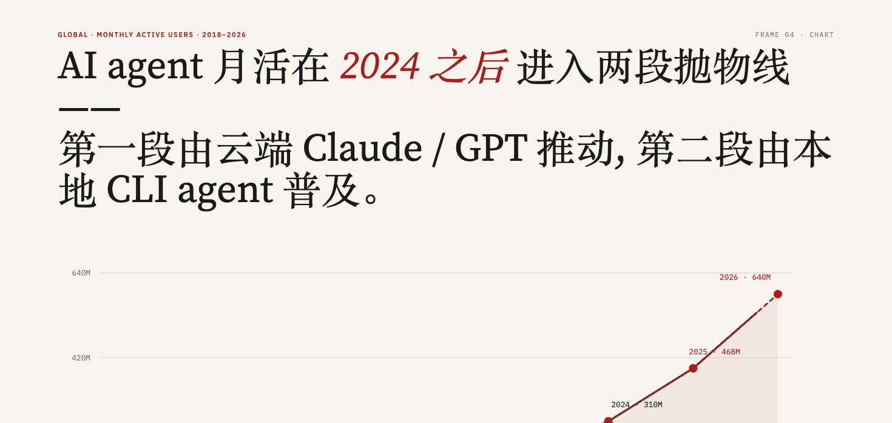
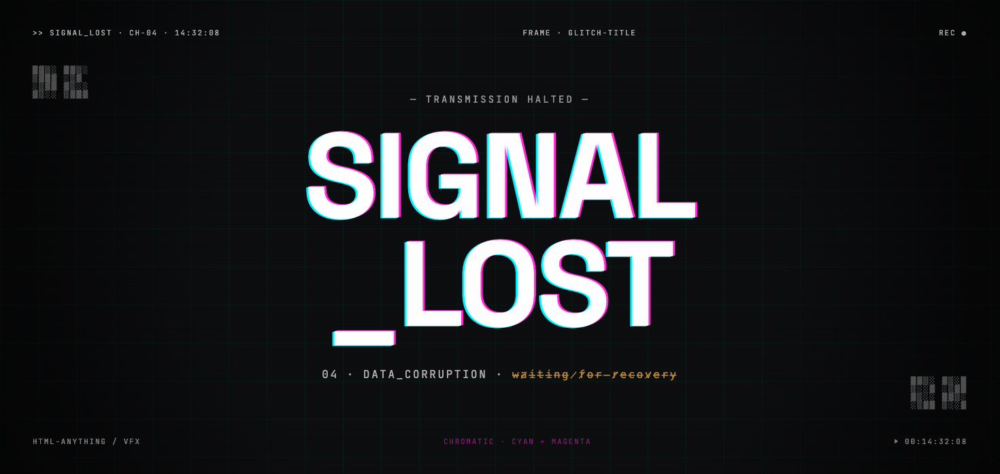
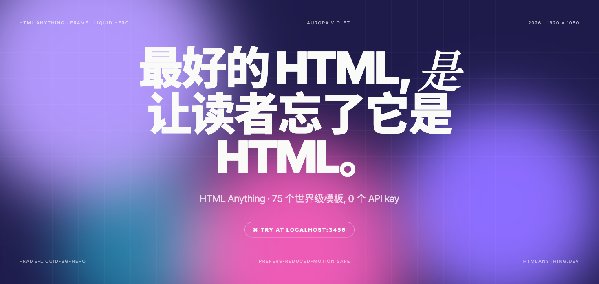
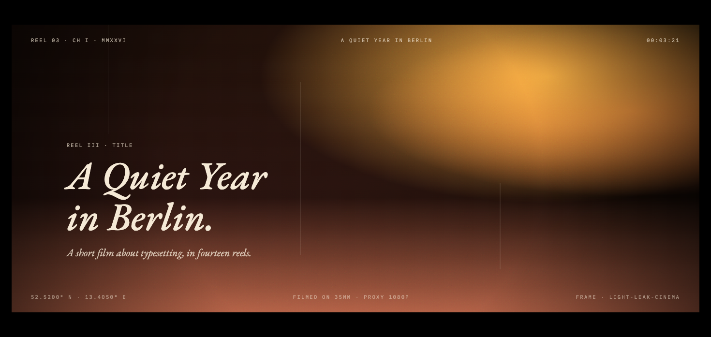
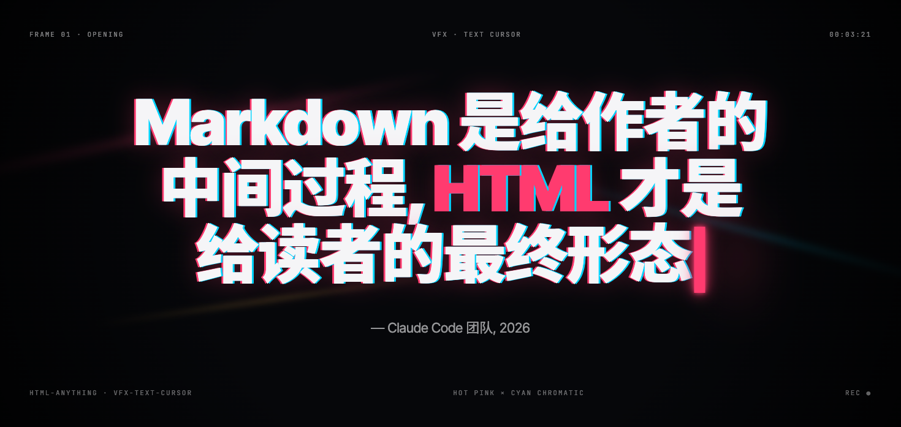
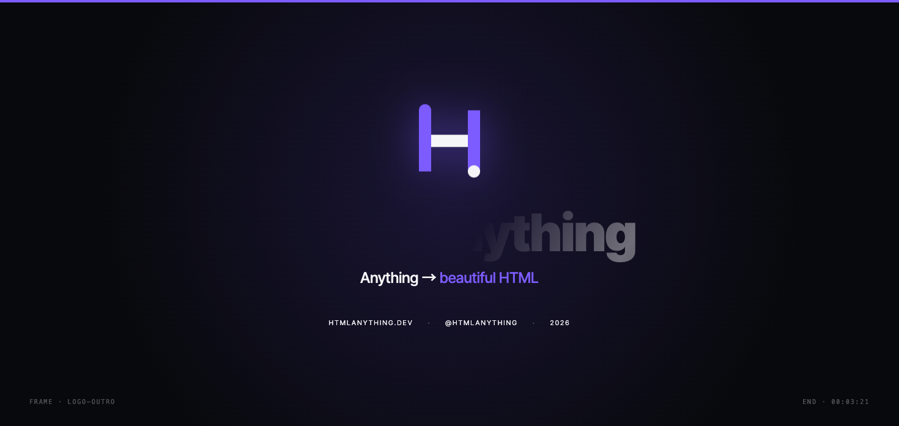

# GO4AI AI Video (`go4ai-ai-video`)

> [!NOTE]
> **Ghi chú**: Dự án này dựa một phần trên [html-video](https://github.com/nexu-io/html-video) của nexu-io, phát hành theo giấy phép Apache License 2.0.
> Toàn bộ codebase đã được **GO4AI viết lại và mở rộng đáng kể** để phù hợp với người dùng Việt Nam không biết code.

<p align="center">
  
</p>

> **HTML biến thành video — ngay trên laptop của bạn, không cần biết code.** GO4AI AI Video là công cụ giúp bạn dùng AI để biến một ý tưởng, một bài viết, hay một repo GitHub thành video hoàn chỉnh — chỉ bằng **double-click** một file, không cần mở terminal, không cần gõ lệnh. Chọn mẫu, mô tả video bạn muốn, và trợ lý AI (Claude Code, Cursor, Gemini, hay bất kỳ agent nào bạn đang dùng) sẽ tự viết, tự dựng khung hình, rồi render ra file MP4 thật ngay trên máy bạn. Miễn phí, mã nguồn mở, không giới hạn số lần render, không phụ thuộc nhà cung cấp nào.

<p align="center">
  <a href="LICENSE"></a>
  <a href="#supported-agents"></a>
  <a href="#showcase"></a>
  <a href="#turn-a-link-into-a-video"></a>
  <a href="#soundtrack"></a>
  <a href="#quick-start"></a>
</p>

<p align="center">
  <b>Xây dựng và duy trì bởi <a href="https://github.com/tbxaigen-design">GO4AI</a></b> · Không trực thuộc và không được nexu-io / Open Design bảo trợ
</p>

<p align="center"><a href="HUONG-DAN-SU-DUNG.md"><b>Hướng dẫn chi tiết tiếng Việt</b></a> · <a href="README.zh-CN.md">简体中文</a></p>

---

## Vì sao GO4AI làm bản này

Bản gốc [html-video](https://github.com/nexu-io/html-video) là một công cụ rất mạnh, nhưng được thiết kế cho **lập trình viên** — muốn dùng phải mở terminal, gõ `pnpm install`, tự cấu hình agent, tự đọc log lỗi. Với đa số người dùng Việt Nam làm nội dung, marketing, giáo dục — những người **không biết code và không có nhu cầu học code** — rào cản đó đủ để họ bỏ cuộc ngay từ bước cài đặt.

GO4AI đã bỏ nhiều công sức để viết lại toàn bộ lớp vận hành: từ dòng lệnh terminal thành **một file để double-click**, từ thông báo lỗi tiếng Anh khó hiểu thành hướng dẫn tiếng Việt rõ ràng, từ việc tự tay cài Node.js/FFmpeg/Chromium thành **tự động tải và cài đặt trong lần chạy đầu tiên**. Đây không phải bản dịch giao diện đơn thuần — là công sức tái cấu trúc để một người chưa từng mở terminal trong đời vẫn có thể tạo video AI chuyên nghiệp trong vài phút.

Mục tiêu của GO4AI: mang công nghệ AI tạo video mã nguồn mở đến gần hơn với cộng đồng người Việt — miễn phí, chạy ngay trên máy cá nhân, dữ liệu không rời khỏi máy bạn trừ khi bạn chủ động dùng tính năng có gọi mạng (lấy nội dung từ link/repo, tạo nhạc AI).

---

<h2 id="showcase">Thư viện mẫu</h2>

Mỗi mẫu dưới đây là một video HTML thật, có chuyển động thật — không phải ảnh dựng. Chọn một mẫu, để AI điền nội dung của bạn vào, rồi xuất ra MP4.

<table>
<tr>
<td width="50%"></td>
<td width="50%"></td>
</tr>
<tr>
<td><b>frame-data-chart-nyt</b> · biểu đồ dữ liệu<br/>Biểu đồ đường động, phong cách báo chí kiểu New York Times — tiêu đề, điểm dữ liệu chú thích, dòng nguồn. Hợp cho câu chuyện kiểu "con số này đã tăng".</td>
<td><b>frame-glitch-title</b> · thẻ tiêu đề<br/>Tiêu đề hiệu ứng glitch (méo màu, scanline). Hợp cho phần mở đầu, hoặc cảm giác "hệ thống đã sẵn sàng".</td>
</tr>
<tr>
<td></td>
<td></td>
</tr>
<tr>
<td><b>frame-liquid-bg-hero</b> · hero<br/>Nền gradient dạng chất lỏng (aurora), tiêu đề căn giữa. Hợp cho ra mắt sản phẩm, tuyên ngôn mạnh.</td>
<td><b>frame-light-leak-cinema</b> · điện ảnh<br/>Hiệu ứng hạt phim + ánh sáng rò rỉ ấm áp. Hợp cho video cảm xúc, phim thương hiệu.</td>
</tr>
<tr>
<td></td>
<td></td>
</tr>
<tr>
<td><b>vfx-text-cursor</b> · hiệu ứng<br/>Chữ hiện dần kiểu đánh máy với con trỏ nhấp nháy. Hợp cho demo kiểu terminal.</td>
<td><b>frame-logo-outro</b> · kết thúc<br/>Thẻ logo động sạch sẽ. Hợp cho phần kết ở cuối bất kỳ video nào.</td>
</tr>
</table>

…và 20 mẫu khác, gồm quảng cáo sản phẩm nhiều cảnh, chữ động (kinetic type), thẻ dữ liệu phong cách Thụy Sĩ/Vignelli, sơ đồ giải thích quyết định, chuyển động hữu cơ kiểu Takram, và phong cách báo chí hạt film ấm. Xem đầy đủ 26 mẫu ngay trong thư viện của studio.

---

## Nó hoạt động thế nào

Một câu mô tả (hoặc một đường link) đi vào; một file MP4 thật đi ra. Quy trình giống nhau dù bạn bắt đầu từ một câu prompt, một bài viết, hay một repo:

```
  prompt / link / repo
        │
        ▼
  ① lấy nguồn            studio tự tải nội dung từ URL hoặc repo, chuyển thành văn bản Markdown
        │
        ▼
  ② vòng lặp agent       AI đọc nội dung + phong cách của mẫu đã chọn, rồi tạo ra
        │                một content-graph (kịch bản phân cảnh) + khối HTML cho mỗi khung hình
        ▼
  ③ content-graph        cấu trúc trung gian đa khung hình — node (thực thể / dữ liệu / văn bản)
        │                + cạnh nối (trình tự / phụ thuộc / đối lập); tự sắp xếp thứ tự & thời lượng
        ▼
  ④ HTML từng khung hình  mỗi node trở thành một khung hình HTML động, độc lập, lưu trên đĩa
        │
        ▼
  ⑤ Hyperframes render   Chromium chạy ẩn tải từng khung hình, ghi lại (tự kéo dài đủ thời gian
        │                chuyển động của khung hình đó) → ra file webm cho mỗi khung
        ▼
  ⑥ ffmpeg               mỗi webm → mp4 (libx264), rồi ghép lại thành một video;
        │                nhạc nền + lời đọc AI (nếu có) được trộn vào
        ▼
      video-cua-ban.mp4
```

Các bước ②–④ là nơi lớp "meta" phát huy: AI quyết định kịch bản, engine quyết định cách vẽ ra, hai phần này không lẫn vào nhau. Bước ⑤ phụ thuộc vào engine cụ thể — sau này thêm Remotion hay Motion Canvas chỉ cần thay bước này, kịch bản và vòng lặp AI giữ nguyên. Mọi thứ chạy trên máy bạn — chỉ có 2 việc cần gọi mạng: lấy nội dung nguồn (khi bạn dán link/repo) và tạo nhạc/giọng đọc AI (khi bạn dùng tính năng đó).

Video một khung hình duy nhất đi theo đường tắt, bỏ qua content-graph — một mẫu, một file HTML, render thẳng.

---

<h2 id="turn-a-link-into-a-video">Biến một đường link thành video</h2>

Đây là cách dùng phổ biến nhất: đưa AI một đường link, nhận lại một video. AI chạy cục bộ trên máy bạn không tự truy cập mạng được, nên studio sẽ **tự lấy nội dung nguồn** ở phía server rồi đưa vào cho AI xử lý — bạn không cần copy-paste nội dung bài viết, và các trang không cần đăng nhập (như bài viết WeChat 公众号) vẫn lấy được bình thường.

```
Bạn:    làm video giải thích bài này  https://mp.weixin.qq.com/s/…
Agent:  được, mình đã đọc xong bài viết — sẽ dựng video dựa trên nội dung này. Bước tiếp theo: chọn phong cách.
→       video giải thích nhiều cảnh, dựng từ đúng nội dung bài viết
```

- **Bài viết web** → được tải và chuyển thành Markdown. Các trang render sẵn phía server như bài viết **WeChat 公众号** hoạt động ngay không cần cấu hình thêm.
- **Repo GitHub** → mô tả, cấu trúc thư mục cấp cao, và README được lấy qua GitHub public API — hợp cho video kiểu "giải thích dự án mã nguồn mở này".
- **Chỉ cần một câu mô tả** → nêu chủ đề, AI tự viết nội dung từ đầu.

Dù nguồn là gì, nó sẽ trở thành nội dung thật để dựng video — không phải trang trí quanh một mẫu có sẵn. AI đọc nội dung đã lấy được, tự quyết định cần bao nhiêu cảnh, rồi viết ra một **kịch bản dạng content-graph**: các ý chính trở thành khung hình, mối quan hệ giữa chúng (ý này nối tiếp ý kia, ý này đối lập ý kia) trở thành các cạnh nối, và phong cách của mẫu đã chọn được áp cho từng khung hình. Vậy nên một bài viết 1.500 từ trở thành một video giải thích nhiều cảnh có nhịp độ, mỗi câu đều bắt nguồn từ nội dung gốc; một repo trở thành một video giải thích có cấu trúc về việc dự án đó thực sự làm gì.

---

<h2 id="quick-start">Bắt đầu nhanh</h2>

### Dành cho mọi người — không cần cài đặt, chỉ cần double-click

Tải repo này về (nút xanh **Code** → **Download ZIP**), giải nén, rồi:

| Máy bạn dùng | Double-click file này |
|---|---|
| **Windows** | `1-Chay-Tren-Windows.bat` |
| **MacBook** | `1-Chay-Tren-Macbook.command` — lần đầu chuột phải → **Open** |

Lần chạy đầu tiên sẽ tự tải mọi thứ cần thiết (Node.js nếu chưa có, các thư viện, FFmpeg, và trình render Chromium — khoảng **300MB**, mất 5–10 phút với mạng bình thường). Các lần chạy sau khởi động chỉ trong vài giây. Trình duyệt sẽ tự mở studio tại `http://127.0.0.1:3075` khi đã sẵn sàng.

Muốn cập nhật phiên bản mới sau này, double-click `2-Cap-Nhat-Windows.bat` / `2-Cap-Nhat-Macbook.command`.

> Hướng dẫn sử dụng chi tiết bằng tiếng Việt: **[HUONG-DAN-SU-DUNG.md](HUONG-DAN-SU-DUNG.md)**

### Dành cho lập trình viên

```bash
pnpm install          # bao gồm binary ffmpeg/ffprobe cho hệ điều hành của bạn
pnpm -r build
node setup-binaries.js   # kiểm tra FFmpeg, cài Chromium + edge-tts
node ui-server.js        # studio chạy tại http://127.0.0.1:3075
```

Mọi thứ render cục bộ trên máy — không render qua cloud, không mất phí theo lượt render.

Các biến môi trường tuỳ chọn: `FFMPEG_PATH`, `FFPROBE_PATH`, `EDGE_TTS_PATH`, `PORT`.

Công cụ dòng lệnh (CLI):

```bash
node packages/cli/dist/bin.js doctor                 # phát hiện agent + engine đã cài
node packages/cli/dist/bin.js search-templates --intent "github stars race" --top 3
```

---

<h2 id="supported-agents">Các AI agent được hỗ trợ</h2>

Tự động phát hiện agent đã cài trên máy (`PATH`); đổi agent đang dùng ngay trong thanh trên cùng của studio. Studio ưu tiên **Open Design (Vela)** — một lần đăng nhập, dùng được nhiều model, chi phí thấp hơn — sau đó tự chuyển sang agent khả dụng đầu tiên tìm thấy, để dự án mới luôn có một backend sẵn sàng chạy.

| Agent | Cách phát hiện | Cách gọi |
|---|---|---|
| **Open Design (Vela)** | `vela` / có sẵn trong app Open Design | ACP qua stdio — đăng nhập một lần trong Open Design, chọn model bất kỳ |
| **Windsurf CLI** | `windsurf` | `windsurf --yolo`, ACP qua stdio |
| **Trae CLI** | `traecli` | `traecli acp serve --yolo`, ACP qua stdio |
| **Claude Code** | `claude` | `claude --print`, prompt qua stdin |
| **Cursor Agent** | `cursor-agent` | `cursor-agent --print` |
| **Codex CLI** | `codex` | `codex exec`, prompt qua stdin |
| **Hermes** | `hermes` | Hermes ACP CLI |
| **Gemini CLI** | `gemini` | Prompt qua stdin |
| **Grok Build** | `grok` | `grok -p <prompt>` |
| **Qwen Code** | `qwen` | Prompt qua stdin |
| **OpenCode** | `opencode` | `opencode run`, prompt qua stdin |
| **GitHub Copilot CLI** | `copilot` | `copilot --allow-all-tools`, prompt qua stdin |
| **Aider** | `aider` | `aider --message <prompt>` |
| **Anthropic API** | Dùng API key riêng (BYOK) | Gọi thẳng Messages API — không cần cài CLI nào |

Chưa cài agent nào? Chỉ cần nhập một Anthropic API key, studio sẽ gọi thẳng Messages API.

---

<h2 id="soundtrack">Nhạc nền & giọng đọc</h2>

Cho video thành phẩm một "tiếng nói". Vào **Settings → Audio**, thêm MiniMax API key, sau đó ở bảng **Soundtrack** trong từng dự án:

- **Nhạc nền** — mô tả không khí bạn muốn (`nhạc nền điện ảnh nhẹ nhàng, cao trào chậm`); MiniMax tự tạo bản nhạc không lời.
- **Lời đọc (narration)** — gõ kịch bản; MiniMax đọc thành giọng nói (TTS).

Cả hai được trộn vào file MP4 xuất ra (nhạc tự giảm âm lượng khi có giọng đọc, có fade in/out tuỳ chọn) qua ffmpeg. Chưa có key? Phần còn lại của studio vẫn hoạt động bình thường.

---

## Kho mẫu (template)

26 mẫu không phải chọn ngẫu nhiên — mỗi mẫu là một đơn vị độc lập, AI đọc được, mô tả bằng file `template.html-video.yaml` mà studio quét khi khởi động. Một manifest chứa mọi thứ AI cần để chọn và điều khiển mẫu mà không cần mở file HTML ra xem:

- **Dùng để làm gì** — `category`, `tags`, và danh sách `best_for` (ví dụ *"Slide doanh nghiệp"*, *"Báo cáo tối giản"*) mà `search-templates` dùng để khớp với ý định của bạn.
- **Xuất ra gì** — độ phân giải hỗ trợ, tỷ lệ khung hình, fps, giới hạn thời lượng, có kênh alpha hay âm thanh không.
- **Cần nhập gì** — một schema JSON `inputs`, để AI biết chính xác cần điền văn bản/dữ liệu vào đâu.
- **Nguồn gốc giấy phép** — mã SPDX cùng các cờ rõ ràng `attribution_required` / `redistribution_allowed` / `commercial_use`, và một khối `assets_attribution` trỏ về nguồn gốc.

Phần cuối cùng này là cố ý. Mỗi mẫu đều **sạch về giấy phép ngay từ khi tạo ra**: bản fork giữ nguyên giấy phép gốc, file [`NOTICE.md`](templates/NOTICE.md) ở gốc repo ghi lại nguồn và SPDX của từng mẫu, và không mẫu nào thiếu giấy phép rõ ràng được đưa vào. Nhờ vậy bạn có thể dùng bất kỳ mẫu nào cho công việc thương mại mà không cần kiểm tra lại. Các mẫu trải rộng từ biểu đồ dữ liệu (kiểu NYT, lưới Thụy Sĩ/Vignelli), tiêu đề & hiệu ứng (glitch, chữ động, con trỏ đánh máy), hero & điện ảnh (gradient chất lỏng, ánh sáng rò rỉ, hạt film ấm), quảng cáo sản phẩm (15s / 30s nhiều cảnh), đến khung giải thích (sơ đồ quyết định) — định dạng này mở, nên mẫu do cộng đồng đóng góp cũng gắn vào theo cách tương tự.

---

## Kiến trúc

```
packages/
├── core/                  Các kiểu dữ liệu Project / Asset / ContentGraph, registry, orchestrator,
│                          MiniMax provider + trộn âm thanh bằng ffmpeg
├── content-graph/         Cấu trúc trung gian đa khung hình (node + cạnh nối, sắp xếp thứ tự)
│ runtime/               Runtime chạy agent — phát hiện / khởi chạy / stream dữ liệu
│                          (Open Design/Vela · Windsurf CLI · Trae CLI · Claude · Cursor · Codex · Gemini · Grok · Qwen · OpenCode · Copilot · Aider · Hermes · Anthropic API)
├── adapter-hyperframes/   Adapter cho engine Hyperframes — render thật qua Chromium + ffmpeg
├── cli/                   Lệnh `html-video` + HTTP server của studio + lấy nội dung nguồn
└── project-studio/        Giao diện studio trên trình duyệt (chat, kho mẫu, khung hình, âm thanh, xuất video)
templates/                 26 mẫu video được tuyển chọn, sạch về giấy phép
research/                  RFC (đặc tả adapter engine / metadata mẫu / skill cho agent / content-graph)
```

---

## Lộ trình phát triển

- [x] Đặc tả adapter engine — một interface, nhiều backend
- [x] Định dạng metadata cho mẫu — ưu tiên giấy phép rõ ràng, AI đọc được
- [x] Quy trình kịch bản đa khung hình (content-graph)
- [x] Studio: kho mẫu trực quan, đổi agent, chỉnh sửa văn bản từng khung hình
- [x] Nguồn nội dung: bài viết / repo GitHub → video
- [x] Nhạc nền AI (nhạc + lời đọc từ MiniMax), trộn khi xuất video
- [x] Render MP4 thật — engine Hyperframes qua Chromium chạy ẩn + ffmpeg
- [x] Chọn model cho agent — backend Open Design (Vela), danh mục model cập nhật trực tiếp
- [ ] Adapter cho Remotion / Motion Canvas / Revideo
- [ ] Gói skill cho agent + chợ mẫu (template marketplace)

---

## Nguồn gốc & tham chiếu

| Dự án | Vai trò |
|---|---|
| [Open Design](https://github.com/nexu-io/open-design) | Dự án anh em — lớp meta-agent cho thiết kế; cùng đội ngũ, cùng triết lý |
| [HTML Anything](https://github.com/nexu-io/html-anything) | Dự án anh em — HTML cho sản phẩm *tĩnh*; html-video là phần *chuyển động* |
| [Hyperframes](https://github.com/heygen-com/hyperframes) | Engine adapter đã triển khai; mô hình render HTML+CSS+GSAP và nguồn của nhiều mẫu Apache-2.0 |

## Giấy phép

[Apache-2.0](LICENSE)

## Được xây dựng bởi

**GO4AI**. Đây là bản phái sinh (derivative work) từ [html-video](https://github.com/nexu-io/html-video) của nexu-io (Apache-2.0), đã được GO4AI viết lại và mở rộng đáng kể — chuyển từ công cụ dành cho lập trình viên dùng terminal thành công cụ **double-click, không cần biết code**, dành cho cộng đồng người Việt. GO4AI **không trực thuộc, không được tài trợ, và không được bảo trợ** bởi nexu-io hay đội ngũ Open Design.

Phát hiện lỗi? Gửi email tới **hocvien@go4ai.life**, mở một [issue](../../issues), hoặc dùng nút **💬 Góp ý & Báo lỗi** ngay trong app — nút này sẽ mở sẵn một email kèm theo thông tin hệ thống của bạn.
